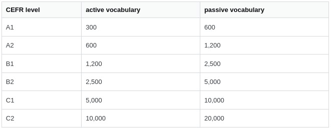
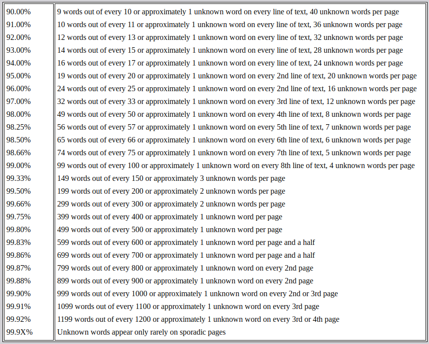

```
100
(0.6620+0.6376+0.7080+0.6359)/4
0.660875                      # 66%

200
(0.7371+0.7145+0.7812+0.7138)/4
0.73665                       # 73#

300
(0.7772+0.7577+0.8178+0.7566)/4
0.777325                      # 77%

500
(0.8261+0.8110+0.8592+0.8103)/4
0.8266499999999999            # 82%

1000
(0.8836+0.8752+0.9065+0.8761)/4
0.88535                       # 88%
--------------------------

(1242+1358+902+1332)/4        # 90%
1208.5
(2807+3009+2591+2976)/4       # 95%
2845.75
(5226+5579+4256+5181)/4       # 98%
5060.5
(7731+8173+6242+7265)/4       # 99%
7352.75
(10711+11133+9029+9522)/4     # 99.5%
10098.75
(13725+14097+12059+11549)/4   # 99.75%
12857.5
(17368+17569+15781+13539)/4   # 99.9%
16064.25
(19958+18086+14468)/3         # 99.95%        radio inf
17504.0
--------------------------
```


